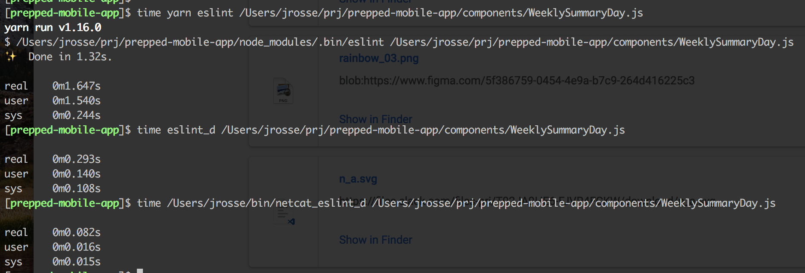

The goal is to use a `netcat`-based way of calling `eslint_d` (per the `eslint_d` README) when linting from vim via ALE to make it run even faster



In `~/.vim/ftplugin/javascript.vim`:
```
" let g:ale_javascript_eslint_executable = 'eslint_d'
let g:ale_javascript_eslint_executable = 'netcat_eslint_d'
```

`~/bin/netcat_eslint_d`:
```
if [ $1 == "--version" ]
then
  echo "v5.16.0 (eslint_d v7.3.0)"
  exit 0
fi

PORT=`cat ~/.eslint_d | cut -d" " -f1`
TOKEN=`cat ~/.eslint_d | cut -d" " -f2`
#if [[ $2 =~ eslintrc$ ]]
#then
#  PROJECT_DIRECTORY=${2%.eslintrc}
#else
#  PROJECT_DIRECTORY=$PWD
#fi
PROJECT_DIRECTORY=/Users/jrosse/prj/prepped-mobile-app

# echo "$PROJECT_DIRECTORY $@" > ~/args
# cat << EOF - > ~/args
# $TOKEN $PROJECT_DIRECTORY $@
# EOF
echo -e "$TOKEN $PROJECT_DIRECTORY $@\n$(cat -)" | nc localhost $PORT
# cat << EOF - | nc localhost $PORT
# $TOKEN $PROJECT_DIRECTORY $@
# EOF
```
I think (since it looks like for `eslint_d` ALE isn't passing `-c path/to/.eslintrc`) instead I'll have to
extract `PROJECT_DIRECTORY` from the `--stdin-filename` arg...? I guess `eslint_d` needs `$PROJECT_DIRECTORY` to pick the
right version of `eslint` to use?

In vim ALE plugin:
In `autoload/ale/handlers/eslint.vim`:
```
function! ale#handlers#eslint#GetExecutable(buffer) abort
    return '/Users/jrosse/bin/netcat_eslint_d'
...
function! ale#handlers#eslint#GetCommand(buffer) abort
    ...
    return l:executable
    \   . (!empty(l:options) ? ' ' . l:options : '')
    \   . ' -f unix --stdin --stdin-filename %s'
```
In `autoload/ale/fixers/eslint.vim`:
```
function! ale#fixers#eslint#ApplyFixForVersion(buffer, version_output) abort
    ...
    " if l:executable =~# 'eslint_d$' && ale#semver#GTE(l:version, [3, 19, 0])
    if l:executable =~# 'netcat_eslint_d$'
```

Measuring vim performance: https://stackoverflow.com/questions/12213597/how-to-see-which-plugins-are-making-vim-slow/12216578#12216578
